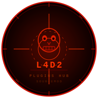
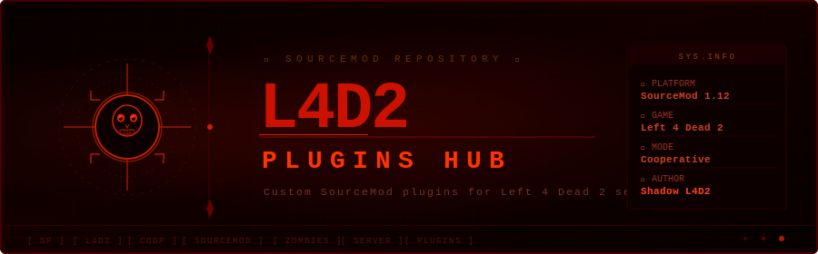

# 🧩 L4D2 Plugins Hub

  

  

Repositorio de plugins personalizados para **Left 4 Dead 2** desarrollados en SourceMod.

Este proyecto funciona como un hub de desarrollo donde se agrupan distintos sistemas, fixes y pruebas para servidores personalizados.

---

## 🎯 Objetivo del proyecto

El objetivo de este repositorio es:

- Crear y probar mecánicas personalizadas para L4D2
- Mejorar o corregir comportamientos del juego
- Desarrollar herramientas para servidores cooperativos
- Mantener código modular y fácil de expandir

---

## 📦 Plugins incluidos

### 🧪 Control Zombies *(experimental)*
Sistema que permite controlar el comportamiento de los zombies en tiempo real.

📁 `scripting/l4d2_control_total_zombie.sp`  
⚠️ No probado completamente, puede contener errores o fallos en servidor

---

### 🧪 L4D2 Machine *(sin probar)*
Plugin en fase inicial de desarrollo, aún sin validación en entorno real.

📁 `scripting/l4d2_machine.sp`  
⚠️ Estado desconocido / experimental

---

### ✅ Smoker Tongue Pull Fix *(estable)*
Corrige el comportamiento del “tongue pull” del Smoker.

✔ Probado y funcional en servidores

---

## 📊 Estado general del proyecto

| Plugin | Estado | Descripción |
|--------|--------|-------------|
| Control Zombies | 🟡 Experimental | Sistema de control de infectados |
| L4D2 Machine | 🔴 Sin probar | Plugin en desarrollo inicial |
| Smoker Fix | 🟢 Estable | Fix funcional del juego |

---

## 🧠 Información del repositorio

Este repositorio no es un solo plugin, sino una **colección de sistemas independientes**.

Cada plugin puede:
- Ser experimental
- Estar en desarrollo
- O estar listo para uso en servidor

---

## 📁 Estructura del proyecto

---

## 🚧 Estado de desarrollo

- 🟢 Estable → listo para servidores
- 🟡 Experimental → en pruebas o desarrollo activo
- 🔴 Sin probar → sin validación en entorno real

---

## ⚙️ Filosofía del proyecto

Este proyecto está enfocado en:

- Experimentación con mecánicas de Left 4 Dead 2
- Desarrollo de plugins modulares en SourceMod
- Pruebas constantes en servidores personalizados
- Evolución progresiva del gameplay

---

## 🧠 Notas importantes

- Algunos plugins pueden cambiar o romperse con actualizaciones
- No todos están listos para uso en producción
- Se recomienda probar en servidores de test

---

## 📜 Licencia

Uso libre con crédito al autor original.
